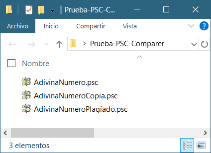
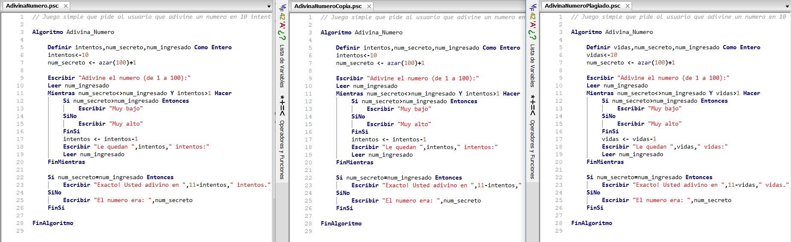
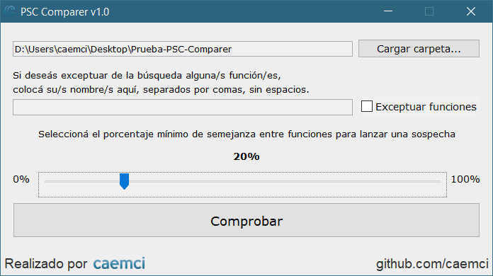
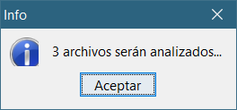
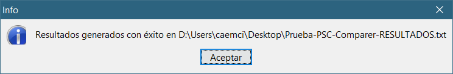
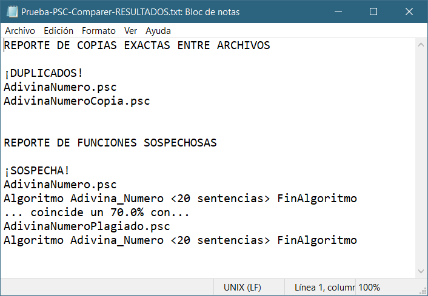
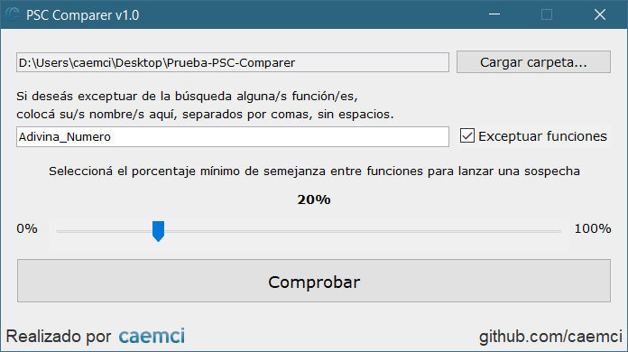
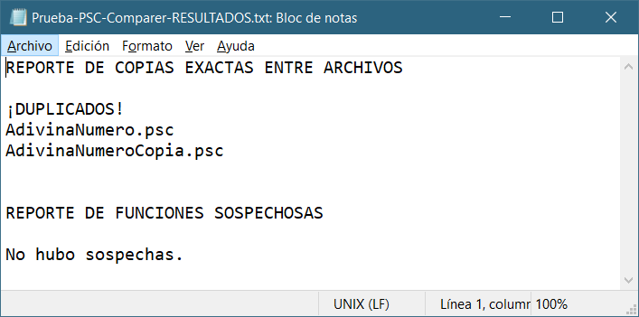

# PSC Comparer

## Descripción

Aplicación hecha en Java que permite analizar exámenes realizados con pseudocódigo del software [PSeInt](http://pseint.sourceforge.net/) (`.psc`) en busca de plagios entre archivos y funciones.

## Prerequisitos

Tener una carpeta con todos los archivos `.psc` a evaluar.

En esta prueba tenemos 3 archivos `.psc` muy similares.

1. `AdivinaNumero.psc`: Un algoritmo de ejemplo integrado en la ayuda de PSeInt
2. `AdivinaNumeroCopia.psc`: Un archivo con exactamente el mismo contenido que `AdivinaNumero.psc`
3. `AdivinaNumeroPlagio.psc`: Un archivo con el mismo algoritmo que `AdivinaNumero.psc` pero con la variable `intentos` renombrada a `vidas`

El programa genera reportes evaluando:
1. La coincidencia exacta entre los archivos.
2. La semejanza entre funciones de los archivos, según la cantidad de líneas idénticas que haya entre ellas. 

## Uso del programa

### Carga

Al ejecutar el programa, el usuario debe elegir la carpeta contenedora de los archivos `.psc` en su computadora.
Si hay éxito en la carga, el programa mostrará cuántos archivos serán analizados.

### Forma de comprobar

1. Se carga cada archivo `.psc` y se guardan sus líneas normalizadas (sin espacios ni tabulados al principio y al final). No se procesan líneas en blanco.
2. Se genera un conjunto de funciones por cada archivo, según la sintaxis del pseudocódigo de PSeInt.
3. Se hace una primera pasada en búsqueda de archivos exactamente iguales en cuanto a sus líneas. Las coincidencias exactas son detectadas y reportadas.
4. Se hace una segunda pasada en búsqueda de funciones sospechosas de plagio. El programa cuenta la cantidad de líneas de la `función1` en el `archivo1` que también están en la `función2` del `archivo2` y retorna un valor relativo porcentual respecto de la cantidad total de líneas de `función1`. En caso de superar el valor establecido por el usuario en el slider, lanza una sospecha al reporte de funciones sospechosas. Se realiza la evaluación de todas las funciones de un archivo por sobre otro, sin importar el orden en el que fueron definidas. La línea de cabecera y la de fin de la función son excluidas del procesamiento para una mayor precisión. 
   
El programa excluye a los archivos duplicados de la evaluación de la semejanza de funciones para evitar redundancias (todas las funciones coincidirían al 100%). Solo deja al primero de ellos para evaluar la semejanza de funciones con otros archivos no idénticos en busca de sospechas de plagio, el cual se haría extensivo a sus copias.

### Resultados generados
Si la comprobación es exitosa, el reporte será generado en un archivo de texto `.txt` en la misma carpeta donde se encuentra el programa.

Para esta prueba, se detectó la coincidencia exacta entre `AdivinaNumero.psc` y `AdivinaNumeroCopia.psc`. Además se lanzó una sospecha de la función `Adivina_Numero` en `AdivinaNumero.psc`, ya que coincide en un 70% con la función `Adivina_Numero` en `AdivinaNumeroPlagio.psc`. Este valor supera al 20% puesto en el ejemplo.

### [Opcional] Excluir una función

Si se espera que una o más funciones sean idénticas en todos los exámenes (por ejemplo, si viene ya dada en el enunciado o si se permitía su reutilización de otros algoritmos) puede activarse la opción de exceptuar funciones y listar solo sus nombres separados por comas (sin espacios) para evitar falsos positivos.

El nuevo reporte detectó nuevamente la coincidencia exacta entre `AdivinaNumero.psc` y `AdivinaNumeroCopia.psc` pero no lanzó sospechas entre `Adivina_Numero` en `AdivinaNumero.psc` y `Adivina_Numero` en `AdivinaNumeroPlagio.psc`.

## Falsos positivos

Un valor muy alto en el slider puede ocasionar casos no detectados. Un valor muy bajo en el slider puede ocasionar falsos positivos.
> La última palabra la tiene el docente. Se sugiere revisar cada sospecha de forma puntual en busca de confirmación de plagio.

## A futuro

Adaptarlo a otros lenguajes con sus respectivas sintaxis.

Proyecto realizado con NetBeans 11.3.